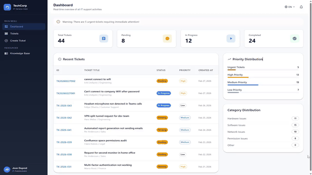

<h1 align="center">IT Ticketing System</h1>

<p align="center">
  A production-grade enterprise IT support platform that combines retrieval-augmented generation (RAG) with asynchronous task processing to deliver real-time, AI-powered ticket analysis across a multilingual interface.
</p>

<p align="center">
  
  
  
  
  
  
  
  
</p>

---

## Demo



---

## Table of Contents

- [Motivation](#motivation)
- [System Architecture](#system-architecture)
- [AI Pipeline: RAG + LLM Analysis](#ai-pipeline-rag--llm-analysis)
- [Internationalization](#internationalization)
- [Observability Stack](#observability-stack)
- [Data Model](#data-model)
- [API Reference](#api-reference)
- [Getting Started](#getting-started)
- [Project Structure](#project-structure)
- [Testing & CI](#testing--ci)
- [License](#license)

---

## Motivation

Enterprise IT departments handle thousands of support tickets per month. Most ticketing systems treat each ticket as an isolated event, requiring a human agent to manually read, classify, prioritize, and draft a response from scratch. This leads to three recurring problems:

1. **Slow first response.** Manual triage creates a bottleneck. Tickets sit in a "pending" queue while agents context-switch between classification and resolution.
2. **Knowledge silos.** Solutions to recurring problems live in individual agents' heads or scattered across email threads. When an experienced agent leaves, institutional knowledge leaves with them.
3. **Blind spots in operations.** Without real-time metrics, managers cannot identify systemic issues (e.g., a spike in network tickets after a firmware update) until damage compounds.

This system addresses all three by integrating a RAG-based AI analysis pipeline directly into the ticket lifecycle. When a ticket is submitted, it is asynchronously analyzed: the system generates a vector embedding, searches for semantically similar past tickets and knowledge base articles, constructs an augmented context, and feeds it to a local LLM (LLaMA 3.2 via Ollama) to produce a category suggestion, confidence score, and step-by-step resolution plan. The entire pipeline runs in a Celery worker so the user receives an immediate HTTP response, with AI results appearing in the UI via polling within 10-20 seconds.

---

## System Architecture

```
                                ┌──────────────────────────────┐
                                │        React 18 (Vite)       │
                                │   MUI · i18next · Axios      │
                                │   4 languages (ZH/EN/FR/NL)  │
                                └──────────────┬───────────────┘
                                               │ REST API
                                ┌──────────────▼───────────────┐
                                │     Django 5 + DRF            │
                                │  ┌─────────────────────────┐ │
                                │  │   ViewSets + Actions     │ │
                                │  │   (assign/resolve/close) │ │
                                │  └────────────┬────────────┘ │
                                │               │ .delay()     │
                                └───────┬───────┼──────────────┘
                                        │       │
                           ┌────────────▼──┐ ┌──▼─────────────────┐
                           │  PostgreSQL 16 │ │   Celery Worker    │
                           │  ─────────────│ │  ┌───────────────┐ │
                           │  tickets      │ │  │ 1. Embed text  │ │
                           │  employees    │ │  │ 2. Search RAG  │ │
                           │  ai_responses │ │  │ 3. Call LLM    │ │
                           │  knowledge    │ │  │ 4. Save result │ │
                           │  history      │ │  └───────────────┘ │
                           └───────────────┘ └─────────┬──────────┘
                                                       │
                                              ┌────────▼────────┐
                                              │   Redis 7       │
                                              │   (Broker +     │
                                              │    Result Store) │
                                              └─────────────────┘

         ┌───────────────────── Observability Layer ──────────────────────┐
         │                                                               │
         │  Prometheus ◄── django-prometheus (HTTP metrics)              │
         │             ◄── postgres-exporter (DB connections, queries)   │
         │             ◄── redis-exporter (memory, ops/sec)             │
         │             ◄── node-exporter (CPU, memory, disk)            │
         │                                                               │
         │  Grafana ◄── Prometheus (auto-provisioned datasource)        │
         └───────────────────────────────────────────────────────────────┘
```

The system runs as **10 containers** orchestrated via Docker Compose:

| # | Service | Role |
|---|---------|------|
| 1 | `frontend` | React SPA served by Nginx |
| 2 | `backend` | Django REST API server |
| 3 | `celery` | Async AI analysis worker |
| 4 | `postgres` | Primary datastore |
| 5 | `redis` | Celery broker + result backend |
| 6 | `prometheus` | Metrics aggregation |
| 7 | `grafana` | Dashboards and alerting |
| 8 | `node-exporter` | Host system metrics |
| 9 | `postgres-exporter` | Database metrics |
| 10 | `redis-exporter` | Cache/queue metrics |

---

## AI Pipeline: RAG + LLM Analysis

When a ticket is created via `POST /api/tickets/`, the Django view calls `analyze_ticket_task.delay(ticket.id)`, offloading the entire AI pipeline to a Celery worker. The pipeline proceeds in four stages:

### Stage 1: Embedding Generation

The ticket's title and description are concatenated and passed to `paraphrase-multilingual-MiniLM-L12-v2` (a 90MB sentence-transformer model running locally). This produces a 384-dimensional dense vector that captures semantic meaning across Chinese, English, French, and Dutch.

```
ticket_text = f"{ticket.title}\n{ticket.description}"
embedding = SentenceTransformer('paraphrase-multilingual-MiniLM-L12-v2').encode(ticket_text)
# → float[384]
```

The embedding is stored directly in a `JSONField` on the Ticket model, eliminating the need for a separate vector database while maintaining full retrieval capability.

### Stage 2: Semantic Search (RAG Retrieval)

The system performs two parallel searches using cosine similarity:

1. **Historical ticket search** — Scans all `closed` tickets with embeddings and returns the top 3 with similarity > 0.5. This surfaces past incidents with proven resolutions.
2. **Knowledge base search** — Scans documentation articles, optionally filtered by the ticket's category, returning the top 2 with similarity > 0.5.

Both searches use NumPy-based cosine similarity computed in-process. For deployments with large ticket histories (>10K), this can be swapped to pgvector with a single migration.

### Stage 3: LLM Analysis

The retrieved context is assembled into a structured prompt and sent to a local LLaMA 3.2 (3B) instance via Ollama:

```
Prompt structure:
  - System: "You are a professional IT support engineer"
  - User context: ticket title, description, current category
  - RAG context: top similar tickets + relevant knowledge articles
  - Instructions: suggest category, confidence (0-1), solution steps
```

The LLM produces a natural-language response. A lightweight post-processor extracts the suggested category via keyword matching against the 5-class taxonomy (hardware / software / network / permission / other).

### Stage 4: Graceful Degradation

If the LLM is unavailable (Ollama not running, timeout, etc.), the system degrades gracefully:

1. **Rule-based classification** kicks in, using keyword matching against a bilingual keyword dictionary (Chinese + English terms for each category).
2. **Template solutions** are generated per category, providing structured troubleshooting steps.
3. The `AIResponse` record is still created with `confidence_score = 0.75` and the fallback solution, so the user always sees a recommendation.

This dual-path design ensures the system never blocks on LLM availability.

### Frontend Integration

The React frontend polls the ticket detail endpoint every 5 seconds. When `ai_responses` appears in the payload, the polling stops and the AI recommendation panel renders with:
- Suggested category chip with confidence percentage
- Full solution text in a styled card
- Similar ticket references (when available)

---

## Internationalization

The system implements full i18n at both the frontend and backend layers:

| Layer | Approach | Languages |
|-------|----------|-----------|
| **Frontend** | `react-i18next` with namespace-scoped JSON files (`common`, `dashboard`, `ticket`, `knowledge`) | ZH, EN, FR, NL |
| **Backend** | Django's `gettext_lazy` for model field labels and choice values | ZH (primary), EN |
| **Dates** | `date-fns` locale-aware formatting (zhCN, enUS, fr, nl) | ZH, EN, FR, NL |

The frontend detects the browser's `Accept-Language` header on first load and persists the choice via `LanguageSwitcher`. All UI strings, form labels, validation messages, error states, and status chips are fully translated. The backend returns both raw values (`status: "pending"`) and display values (`status_display: "待处理"`) so the frontend can use either.

---

## Observability Stack

Prometheus scrapes 5 targets at 15-second intervals:

| Target | Exporter | Key Metrics |
|--------|----------|-------------|
| Django API | `django-prometheus` | HTTP request count/latency by view, DB query count, response codes |
| PostgreSQL | `postgres-exporter` | Active connections, transaction rate, table sizes, slow queries |
| Redis | `redis-exporter` | Memory usage, ops/sec, connected clients, keyspace hits/misses |
| Host | `node-exporter` | CPU, memory, disk I/O, network |
| Prometheus | self-scrape | Scrape duration, target health |

Grafana is auto-provisioned with Prometheus as a datasource via `grafana-datasources.yml`. Operators can build dashboards for ticket volume trends, SLA compliance (resolution time percentiles), and infrastructure health without any manual configuration.

---

## Data Model

```
┌─────────────────────┐       ┌──────────────────────┐
│       Ticket         │       │      Employee         │
├─────────────────────┤       ├──────────────────────┤
│ ticket_number (UK)   │       │ employee_id (PK)      │
│ title                │       │ email (UK)             │
│ description          │       │ name                   │
│ category  ────────── │ enum  │ department             │
│ priority  ────────── │ enum  │ role (employee/        │
│ status    ────────── │ enum  │       it_staff/admin)  │
│ employee_id          │       │ office_location        │
│ employee_name_snap   │       │ is_active              │
│ department_snap      │       └──────────────────────┘
│ assigned_to          │
│ embedding (JSON)     │       ┌──────────────────────┐
│ attachments (JSON)   │       │    KnowledgeBase      │
│ created_at           │       ├──────────────────────┤
│ resolved_at          │       │ title                  │
│ closed_at            │       │ content                │
└──────────┬──────────┘       │ category               │
           │ 1:N               │ embedding (JSON)       │
           │                   │ usage_count            │
┌──────────▼──────────┐       │ success_rate           │
│    AIResponse        │       │ tags (JSON)            │
├─────────────────────┤       │ created_by             │
│ ticket (FK)          │       └──────────────────────┘
│ suggested_category   │
│ confidence_score     │       ┌──────────────────────┐
│ suggested_solution   │       │   TicketHistory       │
│ similar_tickets JSON │       ├──────────────────────┤
│ model_used           │       │ ticket (FK)            │
│ processing_time_ms   │       │ changed_field          │
└─────────────────────┘       │ old_value / new_value  │
                               │ changed_by             │
                               │ comment                │
                               └──────────────────────┘
```

**Design decisions:**

- **Employee snapshots** (`employee_name_snapshot`, `department_snapshot`) on Ticket denormalize the submitter's identity at creation time, so ticket records remain accurate even if the employee later changes departments or names.
- **Embeddings in JSONField** — Storing 384-dim float vectors as JSON arrays in PostgreSQL avoids a pgvector dependency for small-to-medium deployments (<10K tickets). Cosine similarity is computed in Python.
- **TicketHistory as audit log** — Every state transition (assign, resolve, close) creates an immutable history record, enabling full traceability of who changed what and when.

Database indexes cover the four most common query patterns: by `employee_id`, `status`, `category`, and `created_at`.

---

## API Reference

### Tickets

| Method | Endpoint | Description |
|--------|----------|-------------|
| `GET` | `/api/tickets/` | List tickets (filterable by status, category, priority, employee_id, assigned_to) |
| `POST` | `/api/tickets/` | Create ticket (auto-generates ticket number, triggers async AI analysis) |
| `GET` | `/api/tickets/<id>/` | Ticket detail with nested AI responses |
| `PATCH` | `/api/tickets/<id>/` | Update ticket fields |
| `DELETE` | `/api/tickets/<id>/` | Delete ticket |
| `POST` | `/api/tickets/<id>/assign/` | Assign to IT staff (transitions status to `in_progress`) |
| `POST` | `/api/tickets/<id>/resolve/` | Mark resolved (records `resolved_at` timestamp) |
| `POST` | `/api/tickets/<id>/close/` | Close ticket (only allowed from `resolved` status) |

### Employees & Knowledge Base

| Method | Endpoint | Description |
|--------|----------|-------------|
| `GET` `POST` | `/api/employees/` | List / create employees |
| `GET` `PATCH` `DELETE` | `/api/employees/<id>/` | Employee detail |
| `GET` `POST` | `/api/knowledge-base/` | List / create knowledge articles (triggers async embedding generation) |
| `GET` `PUT` `PATCH` `DELETE` | `/api/knowledge-base/<id>/` | Article detail (updates trigger re-embedding) |

**Ticket numbering** follows the pattern `TK{YYYYMMDD}{NNN}` (e.g., `TK20260401001`), auto-generated by the serializer.

---

## Getting Started

### Docker (recommended)

```bash
git clone https://github.com/yaowubarbara/it-ticketing-system.git
cd it-ticketing-system

# Start all 10 services
docker compose up --build -d

# Initialize database
docker compose exec backend python manage.py migrate
docker compose exec backend python manage.py createsuperuser
```

### Service URLs

| Service | URL | Credentials |
|---------|-----|-------------|
| Frontend | http://localhost | — |
| Backend API | http://localhost:8000/api/ | — |
| Django Admin | http://localhost:8000/admin/ | (your superuser) |
| Prometheus | http://localhost:9090 | — |
| Grafana | http://localhost:3001 | admin / admin123 |

### Local Development (without Docker)

```bash
# Backend
cd backend
python -m venv .venv && source .venv/bin/activate
pip install -r requirements.txt
python manage.py migrate
python manage.py runserver

# Celery worker (separate terminal)
celery -A config worker --loglevel=info --pool=solo

# Frontend (separate terminal)
cd frontend
npm install && npm run dev
```

For AI features, install [Ollama](https://ollama.ai) and pull the model:

```bash
ollama pull llama3.2:3b
```

Without Ollama, the system still functions: ticket creation, lifecycle management, and the knowledge base all work normally. AI analysis gracefully falls back to rule-based classification.

---

## Project Structure

```
├── backend/
│   ├── config/
│   │   ├── settings.py          # Django config (DB, Celery, CORS, Prometheus)
│   │   ├── celery.py            # Celery app initialization
│   │   └── urls.py              # Root URL routing
│   ├── ticketing/
│   │   ├── models.py            # 5 models: Ticket, Employee, AIResponse,
│   │   │                        #   KnowledgeBase, TicketHistory
│   │   ├── views.py             # DRF ListCreate/RetrieveUpdateDestroy views
│   │   │                        #   + 3 action endpoints (assign/resolve/close)
│   │   ├── serializers.py       # Auto ticket numbering, display fields,
│   │   │                        #   embedding exclusion
│   │   ├── tasks.py             # 3 Celery tasks: analyze_ticket, generate
│   │   │                        #   knowledge embedding, test
│   │   ├── utils.py             # Embedding generation, cosine similarity,
│   │   │                        #   LLM analysis, rule-based fallback
│   │   └── tests/               # pytest + DRF test client
│   └── requirements.txt
├── frontend/
│   ├── src/
│   │   ├── components/
│   │   │   ├── Dashboard.jsx    # Stats cards, category/priority distribution
│   │   │   ├── TicketList.jsx   # Filterable list with search + status chips
│   │   │   ├── TicketDetail.jsx # Detail view with AI panel + polling
│   │   │   ├── CreateTicket.jsx # Form with category/priority selects
│   │   │   ├── KnowledgeBase.jsx# CRUD for knowledge articles
│   │   │   └── LanguageSwitcher.jsx  # 4-language toggle
│   │   ├── services/api.js      # Axios client with base URL config
│   │   └── i18n/index.js        # i18next setup with browser detection
│   └── public/locales/          # Translation JSON files
│       ├── zh/                  # Chinese (Simplified)
│       ├── en/                  # English
│       ├── fr/                  # French
│       └── nl/                  # Dutch
├── monitoring/
│   ├── prometheus.yml           # 5 scrape targets @ 15s interval
│   └── grafana-datasources.yml  # Auto-provisioned Prometheus source
├── docker-compose.yml           # 10-service orchestration
├── .github/workflows/test.yml   # CI: pytest + coverage on PostgreSQL 16
└── README.md
```

---

## Testing & CI

Tests run on every push and PR via GitHub Actions:

```yaml
# .github/workflows/test.yml
- PostgreSQL 16 service container
- Python 3.13
- pytest with django-pytest + coverage
- Codecov upload
```

Run locally:

```bash
cd backend
pytest -v --cov=ticketing
```

---

## License

MIT
